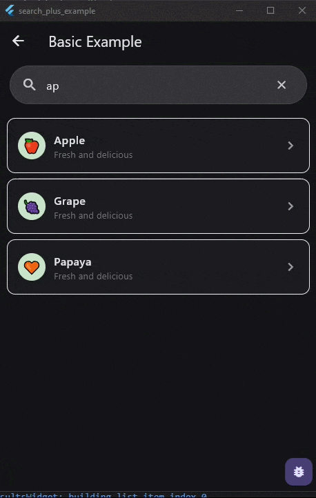
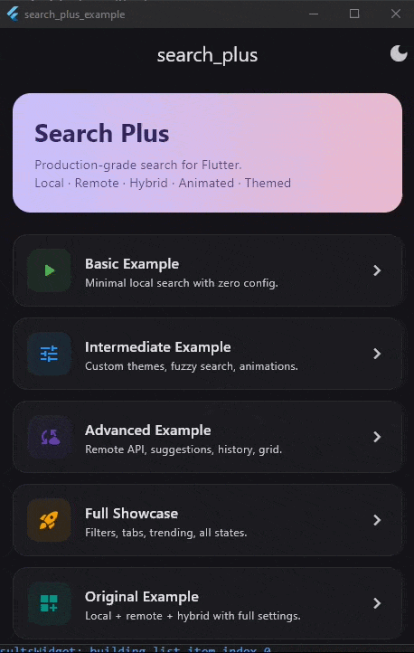
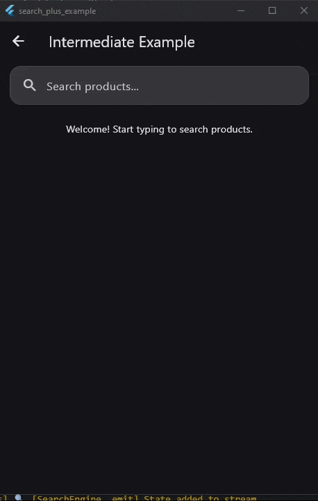
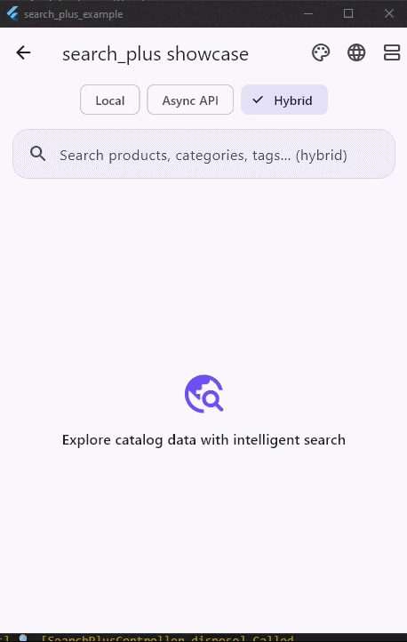
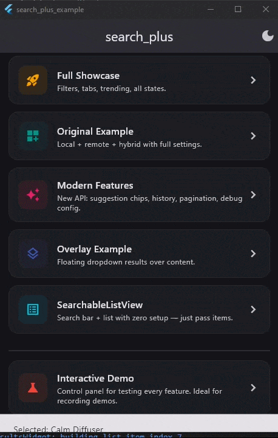

# 🔍 Search Plus


**Production-grade Flutter search — local, remote, and hybrid — with polished UI, overlay mode, theming, animations, persistent history, and a developer experience you'll love.**

Ship fast, beautiful search experiences across mobile, web, and desktop using a clean adapter architecture and ready-to-use Material 3 components.

---

## ✨ Key Features

| Feature | Description |
|---------|-------------|
| ⚡ **Async API Search** | Debounced, cancellation-safe, paginated remote search |
| 💾 **Local Search** | Ranked matching — exact, prefix, contains, and fuzzy (Levenshtein) |
| 🔀 **Hybrid Search** | Merge local + remote results with weighting and deduplication |
| 🧩 **Adapter Architecture** | Plug in any data source via `SearchAdapter<T>` |
| 🖼️ **Built-in UI System** | `SearchScaffold`, `SearchPlusBar`, `SearchResultsWidget` |
| 🪟 **Overlay / Dropdown Mode** | `SearchOverlay` — floating results panel with auto-dismiss |
| 🎞️ **7 Animation Presets** | Fade, slide, scale, staggered — plus shimmer loading |
| 🎨 **Deep Theming** | 30+ customizable properties with Material 3 defaults |
| ⚙️ **SearchConfig** | Advanced behavior: debounce, trim, case, capitalization, limits |
| 💽 **Persistent History** | Pluggable storage (in-memory, secure, or custom) |
| 🌍 **Localization Ready** | 13 customizable strings via `SearchLocalizations` |
| 🧠 **Suggestions + History** | Built-in support in controller and adapters |
| ♿ **Accessible** | Semantic labels, tooltips, keyboard-friendly |
| 📱 **Responsive** | Adaptive layouts for phone, tablet, and desktop |

---

## 📦 Installation

Add `search_plus` to your `pubspec.yaml`:

```yaml
dependencies:
  search_plus: ^1.0.0
```

Then run:

```bash
flutter pub get
```

---

## 🎬 Demo

Visual examples of SearchPlus in action:

### Search Input

<p align="center">
  
</p>

### Live Suggestions

<p align="center">
  
</p>

### Results UI

<p align="center">
  
</p>

### Empty State / No Results

<p align="center">
  
</p>

### Optional Feedback / Toast System

<p align="center">
  
</p>

> **Overlay Mode** — floating dropdown results panel:
>
> <p align="center">
>   
> </p>

---

## ⚡ Quick Start

Get a working search in under 30 seconds:

```dart
import 'package:flutter/material.dart';
import 'package:search_plus/search_plus.dart';

class QuickStartPage extends StatefulWidget {
  const QuickStartPage({super.key});

  @override
  State<QuickStartPage> createState() => _QuickStartPageState();
}

class _QuickStartPageState extends State<QuickStartPage> {
  late final SearchPlusController<String> controller;

  @override
  void initState() {
    super.initState();
    controller = SearchPlusController<String>(
      adapter: LocalSearchAdapter<String>(
        items: ['Apple', 'Banana', 'Cherry', 'Date', 'Elderberry'],
        searchableFields: (item) => [item],
        toResult: (item) => SearchResult(id: item, title: item, data: item),
      ),
    );
  }

  @override
  void dispose() {
    controller.dispose();
    super.dispose();
  }

  @override
  Widget build(BuildContext context) {
    return Scaffold(
      body: SearchScaffold<String>(
        controller: controller,
        hintText: 'Search fruits...',
      ),
    );
  }
}
```

That's it — debouncing, state management, empty/loading/error states, and animations are handled automatically.

---

## 🔍 SearchPlusBar — The Generic Search Input

`SearchPlusBar` is a **standalone, fully generic** Material 3 search input. Unlike
Flutter's built-in `SearchBar`, it is designed to slot into *any* screen, control
*any* data type, and be customized at the widget level without a global theme.

### Why use SearchPlusBar?

| Capability | `SearchPlusBar` | Flutter `SearchBar` | Manual `TextField` |
|---|---|---|---|
| Material 3 styling out of the box | ✅ | ✅ | ❌ (manual) |
| Animated focus elevation & border | ✅ automatic | ❌ | ❌ |
| Built-in clear / voice / filter buttons | ✅ conditional | ❌ | ❌ |
| Debounce progress indicator | ✅ opt-in | ❌ | ❌ |
| `readOnly` + `onTap` (tap-to-navigate) | ✅ | ❌ | ✅ |
| Direct `textStyle` / `hintStyle` override | ✅ | ❌ | ✅ |
| Works with `SearchPlusController<T>` | ✅ plug-and-play | ❌ | ❌ |
| Standalone (no controller needed) | ✅ | ✅ | ✅ |
| Custom `inputFormatters` | ✅ | ❌ | ✅ |
| Deep theming via `SearchTheme` | ✅ | ❌ | ❌ |
| Localization via `SearchLocalizations` | ✅ automatic | ❌ | ❌ |
| Accessibility (semantic labels, tooltips) | ✅ built-in | partial | ❌ (manual) |

### When to use SearchPlusBar

Use it whenever you need a search input — it handles all the boilerplate:

| Scenario | How |
|----------|-----|
| **Product catalog search** | `onChanged` → controller.search() |
| **Tap-to-open search page** | `readOnly: true` + `onTap` |
| **App bar search** | Place inside `AppBar` with custom `height: 44` |
| **Settings / preference filter** | Standalone with `onChanged` only |
| **Chat message search** | Pair with `SearchPlusOverlay` |
| **Command palette / spotlight** | `autofocus: true` + overlay mode |
| **Number-only search** (order IDs) | `keyboardType: TextInputType.number` + `inputFormatters` |
| **Multi-language app** | Wrap in `SearchLocalizationsProvider` |

### SearchPlusBar examples

#### 1. Basic — search a list

```dart
SearchPlusBar(
  onChanged: (query) => controller.search(query),
  hintText: 'Search products…',
)
```

#### 2. Tap-to-navigate (hero search bar)

A common pattern on home screens: a decorative search bar that, when tapped,
pushes a dedicated search page.

```dart
SearchPlusBar(
  readOnly: true,
  onTap: () => Navigator.push(
    context,
    MaterialPageRoute(builder: (_) => const FullSearchPage()),
  ),
  hintText: 'Tap to search…',
  leading: const Icon(Icons.search),
)
```

#### 3. Styled inline — no theme wrapper needed

```dart
SearchPlusBar(
  onChanged: (q) => controller.search(q),
  hintText: 'Find a recipe…',
  textStyle: const TextStyle(fontSize: 18),
  hintStyle: TextStyle(fontSize: 18, color: Colors.grey.shade400),
  height: 52,
  borderRadius: BorderRadius.circular(12),
  backgroundColor: Colors.white,
  elevation: 0,
)
```

#### 4. With voice + filter actions

```dart
SearchPlusBar(
  onChanged: (q) => controller.search(q),
  onSubmitted: (q) => controller.addToHistory(q),
  onVoiceSearch: () => startVoiceInput(),
  onFilterPressed: () => showFilterSheet(context),
  showDebounceIndicator: true,
)
```

#### 5. Number-only input (order ID search)

```dart
SearchPlusBar(
  hintText: 'Enter order number…',
  keyboardType: TextInputType.number,
  inputFormatters: [FilteringTextInputFormatter.digitsOnly],
  onSubmitted: (orderId) => lookUpOrder(orderId),
)
```

#### 6. Inside an AppBar

```dart
AppBar(
  title: SearchPlusBar(
    height: 44,
    onChanged: (q) => controller.search(q),
    hintText: 'Search messages…',
    borderRadius: BorderRadius.circular(22),
    elevation: 0,
  ),
)
```

### SearchPlusBar parameters

| Parameter | Type | Default | Description |
|-----------|------|---------|-------------|
| `onChanged` | `ValueChanged<String>?` | — | Called on every text change |
| `onSubmitted` | `ValueChanged<String>?` | — | Called on keyboard "search" action |
| `onTap` | `VoidCallback?` | — | Called when bar is tapped (tap-to-navigate) |
| `onFocusChanged` | `ValueChanged<bool>?` | — | Called when focus state changes |
| `controller` | `TextEditingController?` | auto | External text controller |
| `focusNode` | `FocusNode?` | auto | External focus node |
| `hintText` | `String?` | localized | Placeholder text |
| `leading` | `Widget?` | search icon | Leading widget |
| `trailing` | `Widget?` | — | Trailing widget |
| `autofocus` | `bool` | `false` | Auto-request focus on mount |
| `enabled` | `bool` | `true` | Whether input is enabled |
| `readOnly` | `bool` | `false` | Display-only mode (combine with `onTap`) |
| `showClearButton` | `bool` | `true` | Show ✕ button when text is present |
| `onVoiceSearch` | `VoidCallback?` | — | Show 🎤 button; callback when pressed |
| `onFilterPressed` | `VoidCallback?` | — | Show filter button; callback when pressed |
| `textInputAction` | `TextInputAction` | `search` | Keyboard action button |
| `textCapitalization` | `TextCapitalization` | `none` | Input capitalization |
| `keyboardType` | `TextInputType?` | platform | Keyboard type (number, email, url, …) |
| `inputFormatters` | `List<TextInputFormatter>?` | — | Input validation / formatting |
| `showDebounceIndicator` | `bool` | `false` | Show typing progress bar |
| `borderRadius` | `BorderRadius?` | theme | Custom border radius |
| `elevation` | `double?` | theme | Custom elevation |
| `backgroundColor` | `Color?` | theme | Custom background color |
| `textStyle` | `TextStyle?` | theme | Direct text style override |
| `hintStyle` | `TextStyle?` | theme | Direct hint text style override |
| `height` | `double?` | 56 | Direct height override |
| `contentPadding` | `EdgeInsets?` | zero | TextField content padding |

---

## 📋 SearchableListView — Ready-to-Use Searchable List

`SearchableListView<T>` is a **convenience widget** that combines `SearchPlusBar`,
`SearchPlusResults`, and an internal `SearchPlusController` into a single,
drop-in widget. Just provide your items, tell it how to extract searchable
text, and how to convert each item to a `SearchResult` — everything else
(debouncing, state management, empty/loading/error states, animations) is
handled for you.

> **When to use `SearchableListView` vs. building manually:**
>
> | Scenario | Recommendation |
> |----------|----------------|
> | Simple searchable list with default layout | ✅ `SearchableListView` |
> | Custom bar + results placement / overlay mode | Use `SearchPlusBar` + `SearchPlusResults` directly |
> | Need an external controller shared across widgets | Use `SearchPlusController` + individual widgets |

### Minimal example

```dart
import 'package:flutter/material.dart';
import 'package:search_plus/search_plus.dart';

class FruitSearchPage extends StatelessWidget {
  const FruitSearchPage({super.key});

  @override
  Widget build(BuildContext context) {
    return Scaffold(
      appBar: AppBar(title: const Text('Fruit Search')),
      body: SearchableListView<String>(
        items: const ['Apple', 'Banana', 'Cherry', 'Date', 'Elderberry'],
        searchableFields: (item) => [item],
        toResult: (item) => SearchResult(id: item, title: item, data: item),
      ),
    );
  }
}
```

### Custom model with item builder

```dart
class Product {
  final String id;
  final String name;
  final String category;
  final String imageUrl;

  const Product({
    required this.id,
    required this.name,
    required this.category,
    required this.imageUrl,
  });
}

class ProductSearchPage extends StatelessWidget {
  const ProductSearchPage({super.key});

  @override
  Widget build(BuildContext context) {
    final products = [
      const Product(id: '1', name: 'Laptop', category: 'Electronics', imageUrl: 'https://example.com/laptop.png'),
      const Product(id: '2', name: 'Sneakers', category: 'Footwear', imageUrl: 'https://example.com/sneakers.png'),
      const Product(id: '3', name: 'Backpack', category: 'Accessories', imageUrl: 'https://example.com/backpack.png'),
    ];

    return Scaffold(
      appBar: AppBar(title: const Text('Products')),
      body: SearchableListView<Product>(
        items: products,
        searchableFields: (p) => [p.name, p.category],
        toResult: (p) => SearchResult(
          id: p.id,
          title: p.name,
          subtitle: p.category,
          data: p,
        ),
        hintText: 'Search products…',
        enableFuzzySearch: true,
        itemBuilder: (context, result, index) => ListTile(
          leading: Image.network(result.data!.imageUrl, width: 48, height: 48),
          title: Text(result.title),
          subtitle: Text(result.subtitle ?? ''),
        ),
        onItemTap: (result) {
          // Navigate to product detail
          debugPrint('Selected: ${result.title}');
        },
      ),
    );
  }
}
```

### Grid layout with theming

```dart
SearchableListView<Product>(
  items: products,
  searchableFields: (p) => [p.name, p.category],
  toResult: (p) => SearchResult(id: p.id, title: p.name, data: p),
  layout: SearchResultsLayout.grid,
  gridCrossAxisCount: 3,
  gridChildAspectRatio: 0.75,
  animationConfig: const SearchAnimationConfig(
    type: SearchAnimationType.staggeredSlide,
  ),
  theme: SearchPlusThemeData(
    barTheme: SearchBarThemeData(
      fillColor: Colors.grey.shade100,
      borderRadius: BorderRadius.circular(16),
    ),
  ),
)
```

### SearchableListView parameters

| Parameter | Type | Default | Description |
|-----------|------|---------|-------------|
| `items` | `List<T>` | **required** | Items to search through |
| `searchableFields` | `List<String> Function(T)` | **required** | Extracts searchable text from each item |
| `toResult` | `SearchResult<T> Function(T)` | **required** | Converts an item into a `SearchResult` |
| `itemBuilder` | `Widget Function(…)?` | null | Custom builder for each result row |
| `onItemTap` | `void Function(SearchResult<T>)?` | null | Called when a result is tapped |
| `onQueryChanged` | `ValueChanged<String>?` | null | Called each time the query text changes |
| `hintText` | `String?` | null | Search bar placeholder |
| `autofocus` | `bool` | `false` | Auto-focus the search bar on mount |
| `showClearButton` | `bool` | `true` | Show clear (×) button when text is present |
| `debounceDuration` | `Duration` | 300 ms | Debounce before executing search |
| `minQueryLength` | `int` | 1 | Minimum characters to trigger search |
| `maxResults` | `int` | 50 | Maximum number of results |
| `enableFuzzySearch` | `bool` | `false` | Enable Levenshtein-distance matching |
| `layout` | `SearchResultsLayout` | `.list` | `.list` or `.grid` |
| `density` | `SearchResultDensity` | `.comfortable` | Compact / comfortable / expanded |
| `animationConfig` | `SearchAnimationConfig` | default | Animation preset and timing |
| `leading` | `Widget?` | null | Leading widget in the search bar |
| `trailing` | `Widget?` | null | Trailing widget in the search bar |
| `onVoiceSearch` | `VoidCallback?` | null | Voice-search callback (shows mic icon) |
| `onFilterPressed` | `VoidCallback?` | null | Filter callback (shows filter icon) |
| `idleBuilder` | `Widget Function(BuildContext)?` | null | Widget to show when no query is entered |
| `headerBuilder` | `Widget Function(…)?` | null | Header above results |
| `footerBuilder` | `Widget Function(…)?` | null | Footer below results |
| `separatorBuilder` | `Widget Function(…)?` | null | Custom separator between list items |
| `theme` | `SearchPlusThemeData?` | null | Theme override |
| `localizations` | `SearchLocalizations?` | null | Localization override |
| `physics` | `ScrollPhysics?` | null | Scroll physics for the list |
| `shrinkWrap` | `bool` | `false` | Shrink-wrap the results list |

---

## 🔌 Using SearchableListView with Custom Widgets

`SearchableListView` is a self-contained widget — it creates and manages its
own `SearchPlusController` and `LocalSearchAdapter` internally. This means
**third-party or custom widgets** (like the `NovaDrawerSearchBar` example below)
can sit alongside or wrap `SearchableListView` without conflicts.

### How NovaDrawerSearchBar works with search_plus

The `NovaDrawerSearchBar` from the **NovaDrawer** package is a great example of
how external libraries build on `search_plus`. Here's how it works:

1. **Controller-based constructor** — accepts an external `SearchPlusController`
   that the caller creates and owns. The drawer bar delegates all search logic
   to the controller.
2. **Simple constructor** — accepts raw `items`, `searchableFields`, and
   `toResult`, then builds a `LocalSearchAdapter` and `SearchPlusController`
   internally (the same pattern `SearchableListView` uses).
3. **Wraps `SearchPlusBar`** — under the hood it renders a `SearchPlusBar`
   with drawer-friendly defaults (padding, overlay toggle, animation config).

#### Example: SearchableListView inside a drawer alongside NovaDrawerSearchBar

```dart
import 'package:flutter/material.dart';
import 'package:search_plus/search_plus.dart';

class AppDrawer extends StatelessWidget {
  const AppDrawer({super.key});

  @override
  Widget build(BuildContext context) {
    final menuItems = ['Home', 'Settings', 'Profile', 'Help', 'About'];

    return Drawer(
      child: SafeArea(
        child: SearchableListView<String>(
          items: menuItems,
          searchableFields: (item) => [item],
          toResult: (item) => SearchResult(
            id: item,
            title: item,
            data: item,
          ),
          hintText: 'Search menu…',
          shrinkWrap: false,
          onItemTap: (result) {
            Navigator.of(context).pop(); // close drawer
            // navigate to selected menu item
          },
          idleBuilder: (context) => ListView(
            children: menuItems
                .map((item) => ListTile(
                      title: Text(item),
                      onTap: () => Navigator.of(context).pop(),
                    ))
                .toList(),
          ),
        ),
      ),
    );
  }
}
```

#### Example: Sharing a controller between NovaDrawerSearchBar and SearchableListView

If your custom search bar (like `NovaDrawerSearchBar`) exposes a
`SearchPlusController`, you can share that controller with other widgets.
However, `SearchableListView` manages its own controller, so use
`SearchPlusBar` + `SearchPlusResults` directly when you need a shared
controller:

```dart
class SharedControllerExample extends StatefulWidget {
  const SharedControllerExample({super.key});

  @override
  State<SharedControllerExample> createState() =>
      _SharedControllerExampleState();
}

class _SharedControllerExampleState extends State<SharedControllerExample> {
  late final SearchPlusController<String> controller;

  @override
  void initState() {
    super.initState();
    controller = SearchPlusController<String>(
      adapter: LocalSearchAdapter<String>(
        items: ['Home', 'Settings', 'Profile', 'Help'],
        searchableFields: (item) => [item],
        toResult: (item) => SearchResult(id: item, title: item, data: item),
      ),
    );
  }

  @override
  void dispose() {
    controller.dispose();
    super.dispose();
  }

  @override
  Widget build(BuildContext context) {
    return Column(
      children: [
        // Your custom search bar (or NovaDrawerSearchBar)
        // drives the shared controller
        SearchPlusBar(
          onChanged: (query) => controller.search(query),
          hintText: 'Search menu…',
        ),
        // Results react to the same controller
        Expanded(
          child: ListenableBuilder(
            listenable: controller,
            builder: (context, _) => SearchPlusResults<String>(
              state: controller.state,
              onItemTap: (result) => debugPrint('Tapped: ${result.title}'),
            ),
          ),
        ),
      ],
    );
  }
}
```

> **Key takeaway:** Use `SearchableListView` when you want an all-in-one
> solution. Use `SearchPlusBar` + `SearchPlusResults` + your own
> `SearchPlusController` when you need to share state between multiple widgets
> (e.g. a custom drawer search bar that drives a results panel elsewhere).

---

## 🆚 Why Search Plus vs. Alternatives

| Feature | **search_plus** | DIY `TextField` + `FutureBuilder` | Flutter `SearchBar` + `SearchAnchor` | Other pub packages |
|---|---|---|---|---|
| Zero boilerplate for full search UX | ✅ | ❌ lots of code | partial | varies |
| Adapter architecture (swap data source) | ✅ | ❌ | ❌ | rare |
| Local + Remote + Hybrid in one package | ✅ | ❌ | ❌ | rare |
| Ranked local search (exact → fuzzy) | ✅ | ❌ | ❌ | some |
| Overlay **and** inline result modes | ✅ | manual | overlay only | varies |
| 7 animation presets + shimmer | ✅ | ❌ | ❌ | some |
| Persistent search history | ✅ pluggable | ❌ | ❌ | some |
| Theming (30+ properties) | ✅ | ❌ | limited | varies |
| Localization (13 strings) | ✅ | ❌ | ❌ | rare |
| Pagination (`loadMore`) | ✅ | manual | ❌ | some |
| Zero runtime dependencies | ✅ | ✅ | ✅ | ❌ (often) |
| Type-safe generics `<T>` | ✅ | ❌ | ❌ | varies |

### Where search_plus is most useful

- **E-commerce apps** — product search with images, categories, filters, and price ranges.
- **Social / messaging apps** — search users, messages, or channels with overlay dropdown.
- **Content apps** (news, blogs, docs) — full-text search with highlighting.
- **Enterprise dashboards** — search tables, reports, or records with pagination.
- **Settings / preference screens** — filter long lists with a minimal search bar.
- **Multi-source apps** — combine local cache + remote API with `HybridSearchAdapter`.
- **Offline-first apps** — `LocalSearchAdapter` works without network, `HybridSearchAdapter` falls back gracefully.

---

## 🧩 Examples

The `/example` app ships with **seven runnable examples**, from minimal to full showcase. Run them with:

```bash
cd example
flutter run
```

### 1. Basic Example

Minimal local search with a flat string list and zero custom UI.

```dart
SearchPlusController<String>(
  adapter: LocalSearchAdapter<String>(
    items: fruits,
    searchableFields: (item) => [item],
    toResult: (item) => SearchResult(id: item, title: item, data: item),
  ),
);
```

### 2. Intermediate Example

Custom item builder, theming, fuzzy search, and stagger animations.

```dart
SearchTheme(
  data: SearchThemeData(
    searchBarTheme: SearchBarThemeData(
      borderRadius: BorderRadius.circular(16),
      focusedBorderColor: colorScheme.primary,
    ),
    resultTheme: SearchResultThemeData(
      highlightColor: colorScheme.primaryContainer,
    ),
  ),
  child: SearchScaffold<Product>(
    controller: controller,
    animationConfig: const SearchAnimationConfig(
      preset: SearchAnimationPreset.staggered,
    ),
    density: SearchResultDensity.rich,
    itemBuilder: (context, result, index) => MyProductTile(result),
  ),
)
```

### 3. Advanced Example

Remote API search with suggestions, search history, trending items, and a toggleable list/grid layout.

```dart
SearchPlusController<AppUser>(
  adapter: RemoteSearchAdapter<AppUser>(
    searchFunction: api.searchUsers,
    suggestFunction: api.suggestUsers,
  ),
  debounceDuration: const Duration(milliseconds: 400),
  maxHistoryItems: 8,
);
```

### 4. Full Showcase

A complete screen with **tabs** (Results / Suggestions / Trending), **category filter chips**, custom product cards, and all states (loading, empty, error, results).

### 5. Original Example

The comprehensive demo: local + remote + hybrid modes, theme switching, localization overrides, animation presets, keyboard navigation, and density settings.

### 6. Overlay Example

Floating dropdown results that appear above page content. Demonstrates the `SearchOverlay` widget with auto-dismiss on outside tap and smooth animations.

```dart
SearchOverlay<Product>(
  controller: controller,
  hintText: 'Search products…',
  maxOverlayHeight: 350,
  animationConfig: const SearchAnimationConfig(
    preset: SearchAnimationPreset.fadeSlideUp,
  ),
  onItemTap: (result) => print('Selected: ${result.title}'),
)
```

### 7. 🧪 Interactive Demo (`searchplus_demo.dart`)

A dedicated test/demo screen with a **control panel drawer** for:

- **Dataset**: Products / Users / Articles
- **Style**: Minimal / Modern SaaS / Dark / Social / Glass / Dark Premium (6 styles)
- **Animation**: All 7 presets
- **Layout**: List / Grid
- **Density**: Compact / Comfortable / Rich
- **Forced State**: Auto / Loading / Empty / Error
- **Result Mode**: Inline / Overlay dropdown toggle
- **API Delay**: 100 ms → 3000 ms slider

Perfect for recording demo videos.

---

## ⚙️ Configuration Options

Use `SearchConfig` for advanced control over search behavior:

```dart
const config = SearchConfig(
  debounceDuration: Duration(milliseconds: 400),
  minQueryLength: 2,
  maxResultCount: 30,
  trimInput: true,
  caseSensitive: false,
  inputTransformation: InputTransformation.lowercase,
  autoCorrect: true,
  textCapitalization: TextCapitalization.none,
  searchInTitle: true,
  searchInSubtitle: true,
  searchInTags: true,
  recentHistoryEnabled: true,
  maxHistoryItems: 10,
  overlayEnabled: false,
  overlayMaxHeight: 400,
  animationEnabled: true,
);
```

### Config Properties

| Property | Type | Default | Description |
|----------|------|---------|-------------|
| `debounceDuration` | `Duration` | 300ms | Debounce delay before search triggers |
| `minQueryLength` | `int` | 1 | Min characters before search starts |
| `maxResultCount` | `int` | 50 | Maximum results returned |
| `trimInput` | `bool` | `true` | Trim whitespace from input |
| `caseSensitive` | `bool` | `false` | Case-sensitive matching |
| `inputTransformation` | `InputTransformation` | `none` | Transform query: none, lowercase, uppercase |
| `autoCorrect` | `bool` | `true` | Enable autocorrect on text field |
| `textCapitalization` | `TextCapitalization` | `none` | Input capitalization mode |
| `searchInTitle` | `bool` | `true` | Search in result titles |
| `searchInSubtitle` | `bool` | `true` | Search in subtitles |
| `searchInTags` | `bool` | `true` | Search in tags/metadata |
| `recentHistoryEnabled` | `bool` | `true` | Enable search history |
| `maxHistoryItems` | `int` | 10 | Max history items to keep |
| `overlayEnabled` | `bool` | `false` | Use overlay dropdown mode |
| `overlayMaxHeight` | `double` | 400 | Max height of overlay panel |
| `animationEnabled` | `bool` | `true` | Enable animations |

---

## 🪟 Overlay Mode

Search Plus offers two result presentation modes:

### Inline Mode (Default)

Results appear below the search bar in the page flow:

```dart
SearchScaffold<Product>(
  controller: controller,
  hintText: 'Search...',
)
```

### Overlay / Dropdown Mode

Results float above page content in a dismissible panel:

```dart
SearchOverlay<Product>(
  controller: controller,
  hintText: 'Search products…',
  maxOverlayHeight: 400,
  overlayElevation: 8,
  closeOnSelect: true,
  animationConfig: const SearchAnimationConfig(
    preset: SearchAnimationPreset.fadeSlideUp,
  ),
  onItemTap: (result) => handleSelection(result),
  itemBuilder: (context, result, index) => ListTile(
    title: Text(result.title),
    subtitle: Text(result.subtitle ?? ''),
  ),
)
```

**Overlay behavior:**

- Opens when results become available
- Closes on outside tap, Escape, or focus loss
- Smooth fade-in/out animation
- Respects all theming and animation configs
- Works on mobile, tablet, and desktop

---

## 💽 Search History Storage

Search Plus provides a pluggable history storage system:

### In-Memory (Default)

History lives only in memory — lost on app restart:

```dart
final manager = SearchHistoryManager(maxItems: 10);
await manager.add('flutter widgets');
print(manager.items); // ['flutter widgets']
```

### Custom Persistent Storage

Implement `SearchHistoryStorage` for any backend:

```dart
class SharedPrefsHistoryStorage extends SearchHistoryStorage {
  final SharedPreferences prefs;
  SharedPrefsHistoryStorage(this.prefs);

  @override
  Future<List<String>> load() async {
    return prefs.getStringList('search_history') ?? [];
  }

  @override
  Future<void> save(List<String> history) async {
    await prefs.setStringList('search_history', history);
  }

  @override
  Future<void> clear() async {
    await prefs.remove('search_history');
  }
}
```

### Secure Fallback Storage

For secure storage backends:

```dart
final storage = SecureFallbackHistoryStorage(
  readFn: () => secureStorage.read(key: 'history') ?? '',
  writeFn: (data) => secureStorage.write(key: 'history', value: data),
  deleteFn: () => secureStorage.delete(key: 'history'),
);

final manager = SearchHistoryManager(
  maxItems: 10,
  storage: storage,
);
await manager.load(); // Load from storage on startup
```

### History Features

- **Deduplication**: Same query won't appear twice
- **Max count**: Oldest entries are dropped automatically
- **Remove individual**: `manager.remove('old query')`
- **Clear all**: `manager.clearAll()`
- **Persistent**: Survives app restarts with custom storage

---

## 🧩 Fake API / Demo Mode

The example app includes a `FakeSearchApi` for realistic demos:

```dart
final api = FakeSearchApi(
  minDelay: Duration(milliseconds: 200),
  maxDelay: Duration(milliseconds: 800),
  errorRate: 0.0, // Set > 0 to simulate errors
);

// Search users, products, or articles
final results = await api.searchUsers('sarah');
final products = await api.searchProducts('keyboard');
final articles = await api.searchArticles('flutter');

// Suggestions
final suggestions = await api.suggestProducts('wire');
```

**Features:**

- Configurable simulated delay
- Configurable error rate for error state testing
- Three datasets: users (10 items), products (12 items), articles (8 items)
- Trending searches and recent search samples included
- Deterministic results for reproducible demos

---

## 🧠 Core Concepts

### Adapter Architecture

```
┌──────────────────┐
│  SearchAdapter<T> │  ← Abstract base
└────────┬─────────┘
         │
    ┌────┴────────────────────┬──────────────────────┐
    │                         │                      │
┌───┴──────────┐  ┌──────────┴─────────┐  ┌────────┴───────────┐
│ LocalSearch  │  │  RemoteSearch      │  │   HybridSearch     │
│ Adapter<T>   │  │  Adapter<T>        │  │   Adapter<T>       │
│              │  │                    │  │                    │
│ In-memory    │  │ Future-based       │  │ Merges local +     │
│ with ranking │  │ async delegation   │  │ remote with dedup  │
└──────────────┘  └────────────────────┘  └────────────────────┘
```

**Local adapter** ranks results using a scoring strategy:

- **Exact match** → 1.0 × `boostExactMatch`
- **Prefix match** → 0.9 × `boostPrefixMatch`
- **Word-start match** → 0.8
- **Contains match** → 0.6
- **Fuzzy match** → similarity × 0.4

**Remote adapter** wraps any `Future`-based search function.

**Hybrid adapter** runs both in parallel, merges results, and deduplicates by ID.

### State Machine

┌──────────────────┐
│  SearchAdapter<T> │  ← Abstract base
└────────┬─────────┘
         │
    ┌────┴────────────────────┬──────────────────────┐
    │                         │                      │
┌───┴──────────┐  ┌──────────┴─────────┐  ┌────────┴───────────┐
│ LocalSearch  │  │  RemoteSearch      │  │   HybridSearch     │
│ Adapter<T>   │  │  Adapter<T>        │  │   Adapter<T>       │
│              │  │                    │  │                    │
│ In-memory    │  │ Future-based       │  │ Merges local +     │
│ with ranking │  │ async delegation   │  │ remote with dedup  │
└──────────────┘  └────────────────────┘  └────────────────────┘
```
idle  ──search()──▸  loading  ──results──▸  success
                       │                       │
                       └──no results──▸ empty   │
                       │                       │
                       └──error──▸ error ◂─────┘
```

Every state transition is smooth — the UI handles each automatically with customizable widgets.

---

## 🎨 Theming Guide

Wrap any search widget in `SearchTheme` to customize visuals:

```dart
SearchTheme(
  data: SearchThemeData(
    searchBarTheme: SearchBarThemeData(
      borderRadius: BorderRadius.circular(18),
      focusedBorderColor: Colors.deepPurple,
      elevation: 0,
      focusedElevation: 4,
    ),
    resultTheme: SearchResultThemeData(
      highlightColor: Colors.deepPurple.shade100,
      contentPadding: EdgeInsets.symmetric(horizontal: 16, vertical: 12),
    ),
  ),
  child: SearchScaffold<String>(controller: controller),
)
```

### Available Theme Properties

**Search Bar** (`SearchBarThemeData`):
`backgroundColor`, `focusedBackgroundColor`, `borderRadius`, `elevation`, `focusedElevation`, `padding`, `height`, `textStyle`, `hintStyle`, `iconColor`, `cursorColor`, `borderColor`, `focusedBorderColor`, `borderWidth`, `shadowColor`

**Results** (`SearchResultThemeData`):
`backgroundColor`, `selectedColor`, `hoveredColor`, `titleStyle`, `subtitleStyle`, `highlightColor`, `highlightStyle`, `dividerColor`, `iconColor`, `sectionHeaderStyle`, `sectionHeaderBackgroundColor`, `contentPadding`, `itemSpacing`, `imageSize`, `imageBorderRadius`

### 6 Built-in Style Presets (in Demo)

| Preset | Look & Feel |
|--------|------------|
| **Minimal** | Clean flat borders, zero elevation |
| **Modern SaaS** | Rounded bars, subtle shadows, primary highlights |
| **Dark** | Dark backgrounds, teal accents |
| **Social** | Pill-shaped bar, compact items |
| **Glass** | Glassmorphism on gradient background |
| **Dark Premium** | Deep navy + red accent, elevated shadows |

---

## 🎞️ Animations

Seven built-in animation presets:

| Preset | Effect |
|--------|--------|
| `none` | No animation |
| `fade` | Fade in |
| `slideUp` | Slide up from bottom |
| `slideRight` | Slide in from left |
| `scale` | Scale from small to full |
| `fadeSlideUp` | Combined fade + slide up |
| `staggered` | Each item animates with a delay |

```dart
SearchScaffold<String>(
  controller: controller,
  animationConfig: const SearchAnimationConfig(
    preset: SearchAnimationPreset.staggered,
    duration: Duration(milliseconds: 280),
    staggerDelay: Duration(milliseconds: 40),
    curve: Curves.easeOutCubic,
  ),
)
```

Shimmer loading is enabled by default — disable it with `showShimmer: false`.

---

## 🌍 Localization

Override any string with `SearchLocalizationsProvider`:

```dart
SearchLocalizationsProvider(
  localizations: const SearchLocalizations(
    hintText: 'Buscar...',
    emptyResultsText: 'Sin resultados',
    errorText: 'Algo salió mal',
    retryText: 'Reintentar',
    loadingText: 'Buscando...',
    resultsCountText: '{count} resultados',
  ),
  child: SearchScaffold<String>(controller: controller),
)
```

All 13 strings are customizable: `hintText`, `emptyResultsText`, `emptyResultsSubtext`, `errorText`, `retryText`, `clearText`, `cancelText`, `searchHistoryTitle`, `suggestionsTitle`, `loadingText`, `resultsCountText`, `voiceSearchTooltip`, `clearSearchTooltip`.

---

## 📱 Responsive Behavior

Search Plus adapts to any screen size:

- **Mobile** (< 600dp): Full-width search bar, list layout, comfortable density
- **Tablet** (600–900dp): Wider content area, optional grid layout
- **Desktop** (> 900dp): Constrained max-width, grid layouts shine

Switch layouts dynamically:

```dart
SearchScaffold<Product>(
  controller: controller,
  layout: isWide ? SearchResultsLayout.grid : SearchResultsLayout.list,
  gridCrossAxisCount: isWide ? 3 : 2,
  density: isCompact
      ? SearchResultDensity.compact
      : SearchResultDensity.comfortable,
)
```

---

## 🎬 Demo Video Scenarios

Use the **Interactive Demo** screen to record these scenarios:

| # | Scenario | Settings |
|---|----------|----------|
| 1 | **Basic search** | Products, SaaS style, fadeSlideUp, List |
| 2 | **Loading state** | Force: Loading, 2000 ms delay |
| 3 | **Empty state** | Search "xyz", observe empty UI |
| 4 | **Error & retry** | Force: Error, then tap retry |
| 5 | **Grid layout** | Products, Grid, Rich density |
| 6 | **Dark mode** | Dark style, staggered animation |
| 7 | **Glassmorphism** | Glass style, scale animation |
| 8 | **Social app feel** | Users dataset, Social style |
| 9 | **Overlay mode** | Toggle overlay on, search products |
| 10 | **Dark Premium** | Premium style, staggered animation |

---

## 📊 Performance Notes

- Use **local adapter** for low-latency offline search
- **Debouncing** reduces unnecessary network calls for remote APIs
- Keep `maxResults` realistic for your UI layout and device class
- Consider **caching** remote results for hybrid experiences
- Use **sectioned** or paged strategies for very large datasets
- Fuzzy search adds overhead — enable only when needed

---

## 🔍 Search System Explained

### Debouncing

Every keystroke is debounced (default: 300 ms). Only the **latest** query's results are shown — stale responses from earlier keystrokes are automatically discarded.

```dart
SearchPlusController<T>(
  adapter: adapter,
  debounceDuration: const Duration(milliseconds: 450),
  minQueryLength: 2,
  maxResults: 30,
);
```

### Suggestions

Both `LocalSearchAdapter` and `RemoteSearchAdapter` support suggestions:

```dart
// Local: prefix-based suggestions come built-in
// Remote: provide your own
RemoteSearchAdapter<T>(
  searchFunction: api.search,
  suggestFunction: (query) => api.suggest(query),
);
```

### Search History

The controller automatically tracks search history:

```dart
controller.addToHistory('flutter');
controller.state.history; // ['flutter']
controller.clearHistory();
```

For persistent history, use `SearchHistoryManager` with a custom `SearchHistoryStorage`.

---

## 🧩 Extensibility

Implement `SearchAdapter<T>` to integrate any data source:

```dart
class AlgoliaSearchAdapter extends SearchAdapter<Product> {
  @override
  Future<List<SearchResult<Product>>> search(
    String query, {int limit = 50, int offset = 0}
  ) async {
    final response = await algolia.search(query);
    return response.hits.map((hit) => SearchResult<Product>(
      id: hit.objectID,
      title: hit['name'],
      subtitle: hit['description'],
      score: hit.score,
      data: Product.fromAlgolia(hit),
    )).toList();
  }
}
```

Works with: **REST**, **GraphQL**, **gRPC**, **Hive**, **Isar**, **SQLite**, **Elasticsearch**, **Algolia**, and more.

---

## 📤 API Reference

### Core Classes

| Class | Purpose |
|-------|---------|
| `SearchPlusController<T>` | Main controller — manages search, debouncing, history |
| `SearchResult<T>` | Immutable result model with score, metadata, source |
| `SearchState<T>` | Immutable state: query, results, status, suggestions, history |
| `SearchStatus` | Enum: `idle`, `loading`, `success`, `empty`, `error` |
| `SearchConfig` | Advanced behavior options: debounce, trim, case, limits |
| `SearchHistoryManager` | Manages history with dedup, limits, and persistence |
| `SearchHistoryStorage` | Abstract interface for history storage backends |

### Adapters

| Adapter | Purpose |
|---------|---------|
| `SearchAdapter<T>` | Abstract base — implement for custom sources |
| `LocalSearchAdapter<T>` | In-memory with ranked matching |
| `RemoteSearchAdapter<T>` | Wraps any async search function |
| `HybridSearchAdapter<T>` | Merges local + remote with deduplication |
| `SearchRankingConfig` | Tuning: weights, fuzzy threshold, boost factors |

### UI Widgets

| Widget | Purpose |
|--------|---------|
| `SearchScaffold<T>` | Complete search UI (bar + results + states) |
| `SearchPlusBar` | Standalone generic Material 3 search input (see [deep-dive](#-searchplusbar--the-generic-search-input)) |
| `SearchPlusResults<T>` | Results display (list / grid / sectioned) |
| `SearchPlusOverlay<T>` | Floating dropdown result panel |
| `SuggestionChips` | Trending / auto-complete suggestion chips |
| `SearchHistoryList` | Recent search history with remove actions |
| `SearchableListView<T>` | All-in-one searchable list (bar + results + controller) |
| `ScrollToTopButton` | FAB that appears on scroll |
| `SearchEmptyState` | No-results UI |
| `SearchErrorState` | Error UI with retry |
| `SearchLoadingState` | Loading UI with shimmer |
| `HighlightText` | Highlights matching query in text |
| `AnimatedSearchItem` | Wraps items with animation |
| `ShimmerLoading` | Skeleton loading effect |

### Theming & Localization

| Class | Purpose |
|-------|---------|
| `SearchTheme` | InheritedWidget for theme propagation |
| `SearchThemeData` | Theme configuration container |
| `SearchBarThemeData` | Search bar visual properties |
| `SearchResultThemeData` | Result item visual properties |
| `SearchLocalizationsProvider` | InheritedWidget for l10n propagation |
| `SearchLocalizations` | All customizable strings |

---

## 🧠 Developer Notes

### Architecture Overview

```
lib/
├── search_plus.dart              # Public API barrel file
└── src/
    ├── adapters/                 # Data source abstractions
    │   ├── search_adapter.dart
    │   ├── local_search_adapter.dart
    │   ├── remote_search_adapter.dart
    │   └── hybrid_search_adapter.dart
    ├── animations/               # Animation system
    │   └── animation_presets.dart
    ├── cache/                    # Caching layer
    │   ├── search_cache.dart
    │   └── cached_search_adapter.dart
    ├── core/                     # Business logic
    │   ├── search_controller.dart
    │   ├── search_result.dart
    │   ├── search_state.dart
    │   ├── search_config.dart
    │   ├── search_plus_config.dart
    │   └── search_history_storage.dart
    ├── l10n/                     # Localization
    │   └── search_localizations.dart
    ├── remote/                   # Enhanced remote features
    │   ├── remote_search_config.dart
    │   ├── retry_strategy.dart
    │   ├── cancellable_operation.dart
    │   ├── query_deduplicator.dart
    │   └── enhanced_remote_adapter.dart
    ├── theme/                    # Theming
    │   └── search_theme.dart
    ├── utils/                    # Utilities
    │   └── search_logger.dart
    └── ui/                       # Widgets
        ├── search_scaffold.dart
        ├── search_bar_widget.dart    ← SearchPlusBar (generic search input)
        ├── search_results_widget.dart
        ├── search_overlay.dart
        ├── suggestion_chips.dart
        ├── search_history_list.dart
        ├── scroll_to_top_button.dart
        ├── debug/
        │   └── search_debug_panel.dart
        ├── devtools/
        │   └── search_devtools_panel.dart
        ├── pro/
        │   ├── skeleton_loading.dart
        │   ├── highlight_text.dart
        │   ├── glassmorphism_container.dart
        │   └── search_plus_screen.dart
        └── states/
            └── search_states.dart
```

### Clean Code Philosophy

- **Separation of concerns**: UI, state, and data are fully decoupled
- **Immutable state**: `SearchState` and `SearchResult` are immutable
- **Generic types**: Full type safety with `SearchAdapter<T>`, `SearchResult<T>`, `SearchPlusController<T>`
- **Composable widgets**: Use `SearchPlusBar` alone, pair it with `SearchPlusResults`, or use the all-in-one `SearchScaffold` — your choice
- **No external dependencies**: Zero runtime dependencies beyond Flutter SDK
- **Tree-shakeable**: Import only what you use

---

## 🛠 Troubleshooting

### Search returns "No results found" unexpectedly

- Verify your `searchableFields` callback returns the right strings
- Check `minQueryLength` — queries shorter than this won't trigger search
- Ensure your fake/remote API actually matches the query (case-insensitive by default)

### Overlay doesn't close on outside tap

- `SearchOverlay` auto-closes on focus loss with a 150ms delay
- If using custom focus management, ensure the focus node can lose focus

### Animations are not visible

- Check `animationConfig.enabled` is `true`
- Ensure `animationConfig.preset` is not `SearchAnimationPreset.none`
- Try increasing `duration` for more noticeable effects

### History isn't persisted

- The default `InMemoryHistoryStorage` loses data on restart
- Use `SecureFallbackHistoryStorage` or implement `SearchHistoryStorage` for persistence

### Import conflicts with Flutter's `SearchBarThemeData`

- Use `import 'package:flutter/material.dart' hide SearchBarThemeData;` to resolve conflicts

### SearchPlusBar onTap not firing

- Ensure `enabled` is `true` (the default). A disabled bar ignores taps.
- If using `readOnly: true`, the `onTap` callback fires on the `TextField` tap — make sure the bar is not obscured by another widget.

---

## 📝 Getting Started Checklist

New to search_plus? Follow this path:

1. **Install** — add `search_plus` to `pubspec.yaml` and run `flutter pub get`.
2. **Pick an adapter** — `LocalSearchAdapter` for in-memory, `RemoteSearchAdapter` for API, or `HybridSearchAdapter` for both.
3. **Create a controller** — `SearchPlusController<YourModel>(adapter: yourAdapter)`.
4. **Drop in a widget** — start with `SearchScaffold` for the full experience, or `SearchPlusBar` + `SearchPlusResults` for more control.
5. **Customise** — apply a `SearchTheme`, add animations, tweak `SearchConfig`, or override localizations.
6. **Ship** 🚀

---

## License

MIT — see [`LICENSE`](LICENSE).

---

*Made with ❤️ for the Flutter community*
